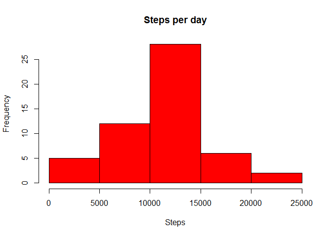
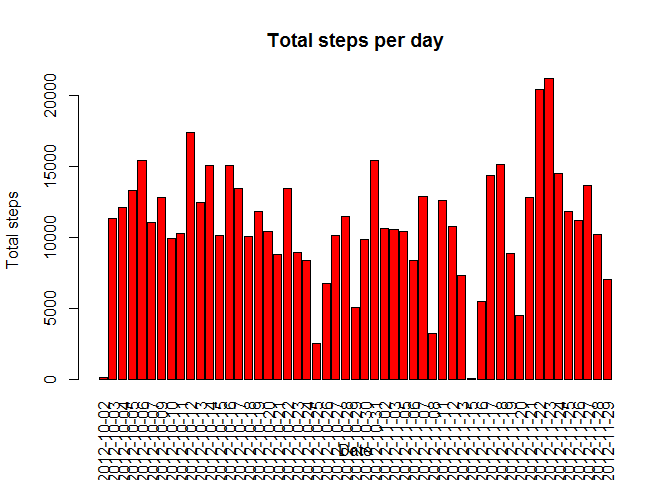
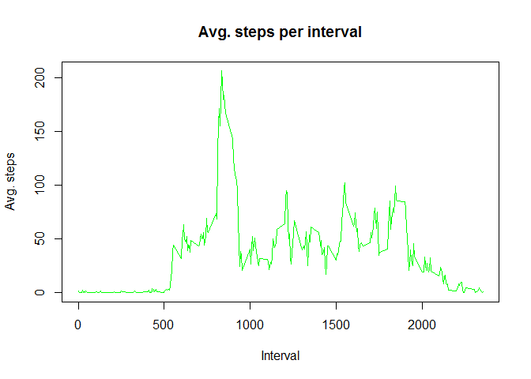
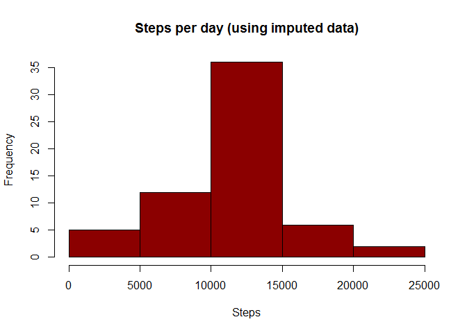
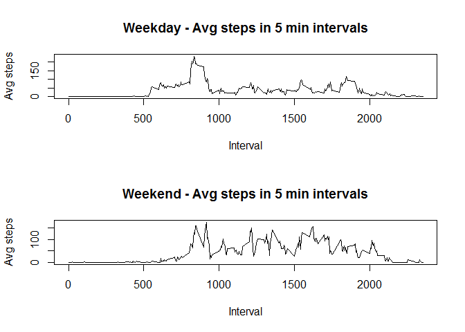

Reproducible Research - Course Project 1
========================================

Read data in. Assumption is that activity.csv is in the current working directory

```r
data <- read.csv("activity.csv")
```
Fix the data type for date field

```r
data$date <- as.Date(data$date, format = "%Y-%m-%d")
```

## 1. What is mean total number of steps taken per day?
1.1 Calculate the total number of steps taken per day

```r
total_steps_per_day <- aggregate(steps ~ date, data, sum)
```
Display first few rows of total steps per day

```r
head(total_steps_per_day)
```

```
##         date steps
## 1 2012-10-02   126
## 2 2012-10-03 11352
## 3 2012-10-04 12116
## 4 2012-10-05 13294
## 5 2012-10-06 15420
## 6 2012-10-07 11015
```
1.2 - If you do not understand the difference between a histogram and a barplot, research the difference between them. 
Make a histogram of the total number of steps taken each day

```r
hist(total_steps_per_day$steps, xlab = "Steps", col = "red", main = "Steps per day")
```

\

Alternative interpretation of this can be to plot the dates on x-axis and total steps on y-axis

```r
barplot(total_steps_per_day$steps, names.arg = total_steps_per_day$date, xlab = "Date", ylab = "Total steps", main = "Total steps per day", col="red", las=3)
```

\

1.3 - Calculate and report the mean and median of the total number of steps taken per day

```r
mean(total_steps_per_day$steps)
```

```
## [1] 10766.19
```

1.3 - Calculate and report the mean and median of the total number of steps taken per day

```r
median(total_steps_per_day$steps)
```

```
## [1] 10765
```
## 2. What is the average daily activity pattern?
2.1 - Make a time series plot (i.e. type = "l") of the 5-minute interval (x-axis) and the average number of steps taken, averaged across all days (y-axis)

```r
avg_steps_per_5min_interval <- aggregate(steps ~ interval, data, mean)
plot(avg_steps_per_5min_interval$interval, avg_steps_per_5min_interval$steps, type ="l", xlab = "Interval", ylab = "Avg. steps", main = "Avg. steps per interval", col = "green")
```

\

2.2 - Which 5-minute interval, on average across all the days in the dataset, contains the maximum number of steps?

```r
avg_steps_per_5min_interval[avg_steps_per_5min_interval$steps == max(avg_steps_per_5min_interval$steps),]
```

```
##     interval    steps
## 104      835 206.1698
```

## 3. Imputing missing values
3.1 - Calculate and report the total number of missing values in the dataset (i.e. the total number of rows with NAs)

```r
nrow(data) - sum(complete.cases(data)) # 2304 rows/records with missing values
```

```
## [1] 2304
```
3.2 - Create a copy of the original data to impute values into

```r
imputed_data <- data
```
3.3 - Strategy to impute missing values is to replace it with the avg of that specific 5 minute interval.
Use a for lop to do this

```r
for(i in 1:length(imputed_data$steps))
{      
    if(is.na(imputed_data[i,1]))
	{
        imputed_data[i,1] = avg_steps_per_5min_interval[avg_steps_per_5min_interval$interval== imputed_data[i,3], 2]	
    }
}
```
Convert the newly imputes values to integer

```r
imputed_data$steps <- as.integer(imputed_data$steps)
```
 Double check to make sure that that the percentage of NA values for steps in the imputed_data is 0

```r
mean(is.na(imputed_data$steps))
```

```
## [1] 0
```
3.4 - Make a histogram of the total number of steps taken each day and Calculate and report the mean 
and median total number of steps taken per day. Do these values differ from the estimates from 
the first part of the assignment? What is the impact of imputing missing data on the estimates of the 
total daily number of steps?

```r
imputed_total_steps_per_day <- aggregate(steps ~ date, imputed_data, sum)
hist(imputed_total_steps_per_day$steps, xlab = "Steps", col = "darkred", main = "Steps per day (using imputed data)")
```

\

```r
mean(imputed_total_steps_per_day$steps)
```

```
## [1] 10749.77
```

```r
median(imputed_total_steps_per_day$steps)
```

```
## [1] 10641
```
Observation: The mean and median for  dataset with imputed values is 10749.77 and 10641 respectively compared to
the mean amd median for original dataset  which is 10766.19 and 10765 respectively. There is a very slight difference
in the mean and median.

## 4. Are there differences in activity patterns between weekdays and weekends?
4.1 - Create a new factor variable in the dataset with two levels – “weekday” and “weekend” 
indicating whether a given date is a weekday or weekend day

```r
data$dayoftheweek <- weekdays(data$date)
data$nw_field <-ifelse(data$dayoftheweek=="Monday", "weekday",
				ifelse(data$dayoftheweek=="Tuesday", "weekday",
				ifelse(data$dayoftheweek=="Wednesday", "weekday",
				ifelse(data$dayoftheweek=="Thursday", "weekday",
				ifelse(data$dayoftheweek=="Friday", "weekday",
				ifelse(data$dayoftheweek=="Saturday", "weekend",
				ifelse(data$dayoftheweek=="Sunday", "weekend",				
                        NA  ))))))) 

data$nw_field <- as.factor(data$nw_field)
weekday_data <- subset(data, data$nw_field == "weekday")
weekend_data <- subset(data, data$nw_field == "weekend")
weekday_data_avgstepsper5mininterval <- aggregate(steps ~ interval, weekday_data, mean)
weekend_data_avgstepsper5mininterval <- aggregate(steps ~ interval, weekend_data, mean)
```
4.2 - Make a panel plot containing a time series plot (i.e. type = "l") of the 5-minute interval 
(x-axis) and the average number of steps taken, averaged across all weekday days or weekend days (y-axis)

```r
par(mfrow=c(2,1))
plot(weekday_data_avgstepsper5mininterval$interval, weekday_data_avgstepsper5mininterval$steps, type = "l", main = "Weekday - Avg steps in 5 min intervals", xlab = "Interval", ylab = "Avg steps")
plot(weekend_data_avgstepsper5mininterval$interval, weekend_data_avgstepsper5mininterval$steps, type = "l", main = "Weekend - Avg steps in 5 min intervals", xlab = "Interval", ylab = "Avg steps")
```

\

Observation: It is evident that there is lot of activity occuring on the weekends as compared to weekdays.
